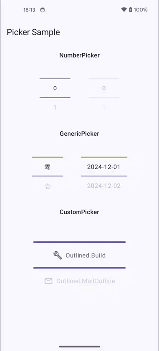

# Jetpack Compose Picker

Android library providing a Picker implemented by Jetpack Compose.

[](https://central.sonatype.com/artifact/com.seo4d696b75.compose/material3-picker)


## Features



- ✅️ Same experience as [NumberPicker view](https://developer.android.com/reference/android/widget/NumberPicker)
- ✅️ Supports scroll and fling
- ✅️ Compatible with Material3
- ✅️ Custamizable with slot pattern

## Installation

In your module level `build.gradle` file

```gradle
dependencies {
    implementation("com.seo4d696b75.compose:material3-picker:$version")
}
```

## Basic Usage

> [!NOTE]
>
> `range` and `values` arguments are defined as `ImmutableList` instead of `List` interface
> for performance considerations. 
> see [kotlinx.collections.immutable](https://github.com/Kotlin/kotlinx.collections.immutable)

### Number picker


```kotlin
    var value by remember { mutableIntStateOf(0) }

    NumberPicker(
        value = value,
        range = (0..10).toPersistentList(),
        onValueChange = { value = it },
    )
```

### Picker with generic values


```kotlin
    val values = remember {
        persistentListOf(
            LocalDate.of(2024, 12, 1),
            LocalDate.of(2024, 12, 2),
            LocalDate.of(2024, 12, 3),
            LocalDate.of(2024, 12, 4),
            LocalDate.of(2024, 12, 5),
            LocalDate.of(2024, 12, 6),
        )
    }
    var index by remember { mutableIntStateOf(0) }

    Picker(
        index = index,
        values = values,
        onIndexChange = { index = it },
    )
```

### Customize picker


```kotlin
    val values = remember {
        persistentListOf(
            Icons.Outlined.Build,
            Icons.Outlined.MailOutline,
            Icons.Outlined.Call,
            Icons.Outlined.AccountCircle,
            Icons.Outlined.Create,
            Icons.Outlined.Delete,
        )
    }
    val state = rememberPickerState(values)

    Picker(
        state = state,
        enabled = true,
        colors = PickerDefaults.colors(contentColor = MaterialTheme.colorScheme.secondary),
        labelSize = DpSize(240.dp, 64.dp),
        dividerHeight = 4.dp,
        flingBehavior = PickerDefaults.flingBehavior(state = state, flingEnabled = false),
    ) { icon, enabled ->
        Row(
            horizontalArrangement = Arrangement.spacedBy(8.dp),
            verticalAlignment = Alignment.CenterVertically,
        ) {
            Icon(
                imageVector = icon,
                contentDescription = null,
            )
            Text(text = icon.name)
        }
    }
```
